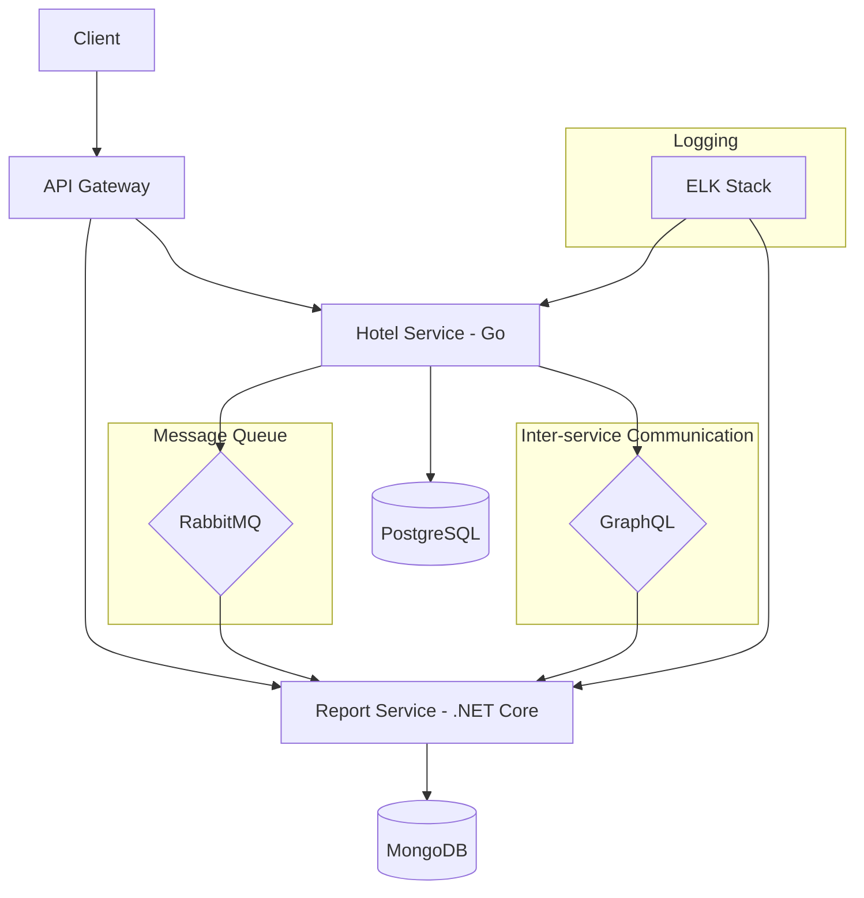

# Hotel Guide Microservices Project

## Overview

This project implements a simple hotel guide application using a microservices architecture. It consists of two main services that communicate with each other:

1. Hotel Service (Go)
2. Report Service (.NET Core)

The application provides functionalities for managing hotels, their contact information, and generating location-based statistical reports.

## Features

- Hotel management (create, delete)
- Hotel contact information management (add, remove)
- Listing hotel authorities
- Retrieving detailed hotel information
- Generating asynchronous location-based statistical reports
- Listing and retrieving system-generated reports

## Architecture

The system uses the following technologies:

- Go (Hotel Service)
- .NET Core (Report Service)
- PostgreSQL (Hotel Service database)
- MongoDB (Report Service database)
- RabbitMQ (Message Queue for asynchronous communication)
- GraphQL (for inter-service communication)
- Docker and Docker Compose (for containerization and orchestration)
- ELK Stack (Elasticsearch, Logstash, Kibana) for logging

### System Architecture Diagram



## Project Structure

```
hotel_report/
├── hotel-service/
│   └── (Go service files)
├── report-service/
│   └── (.NET Core service files)
└── README.md
```

## Prerequisites

- Docker and Docker Compose
- Go 1.21 or later (for local development of Hotel Service)
- .NET Core 7.0 or later (for local development of Report Service)

## Getting Started

1. Clone the repository:
   ```
   git clone https://github.com/tfgoztok/hotel_report.git
   cd hotel_report
   ```

2. Start each service using Docker Compose:
   ```
   docker-compose up --build
   ```

3. The services will be available at:
   - Hotel Service: http://localhost:8080
   - Report Service: http://localhost:5000

## API Documentation

For detailed API documentation, please refer to the individual service README files:

- [Hotel Service README](./hotel-service/README.md)
- [Report Service README](./report-service/README.md)

## Testing

Both services include unit and integration tests. To run the tests:

For Hotel Service:
```
cd hotel-service
go test ./...
```

For Report Service:
```
cd report-service
dotnet test
```

## Logging

The ELK stack is used for centralized logging. Access the Kibana dashboard at http://localhost:5601 to view and analyze logs.