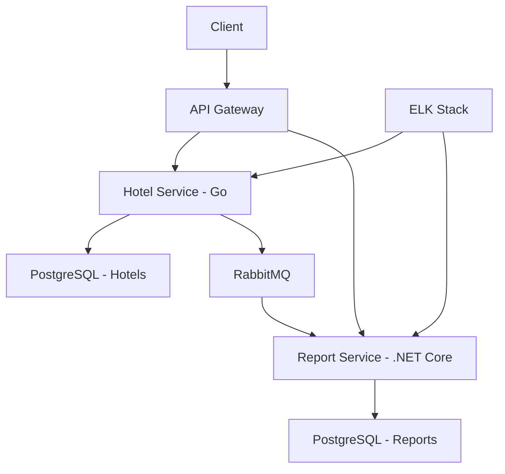

# Hotel Guide Microservices Project

This project aims to design and implement a simple hotel guide application using a minimum of two microservices that can communicate with each other. The expected functionalities of this application include:

1. **Hotel Creation**: The ability to create a new hotel entry in the system.
2. **Hotel Deletion**: The ability to remove an existing hotel entry from the system.
3. **Adding Hotel Communication Information**: The ability to add communication information (e.g., phone number, email) for a hotel.
4. **Removing Hotel Communication Information**: The ability to remove communication information for a hotel.
5. **Listing Hotel Authorities**: The ability to list the authorities or personnel associated with a hotel.
6. **Retrieving Hotel Details with Communication Information**: The ability to retrieve detailed information about a hotel, including its communication information.
7. **Generating Location-Based Statistics for Hotels**: The ability to generate reports based on the location of hotels.
8. **Listing System-Generated Reports**: The ability to list all reports generated by the system.
9. **Retrieving Details of a System-Generated Report**: The ability to retrieve detailed information about a specific report generated by the system.

This project focuses on designing a scalable and efficient architecture to support these functionalities, ensuring seamless communication between the microservices involved.

Hotel Guide Application - System Design
=====================================

### 1. System Architecture Overview

The hotel guide application will be built using a microservices architecture, consisting of two main services:

* **Hotel Service** (Go)
* **Report Service** (.NET Core)

These services will communicate with each other asynchronously using a message queue system (RabbitMQ). The system will use a PostgreSQL database for data persistence.

### System Architecture Diagram

### 2. Service Descriptions

#### 2.1 Hotel Service (Go)

**Responsibilities:**

* CRUD operations for hotels
* CRUD operations for hotel contact information
* Listing hotel officials
* Retrieving detailed hotel information
* Initiating report generation requests

**API Endpoints:**

* `POST /api/hotels` - Create a new hotel
* `DELETE /api/hotels/{id}` - Remove a hotel
* `POST /api/hotels/{id}/contacts` - Add contact information to a hotel
* `DELETE /api/hotels/{id}/contacts/{contactId}` - Remove contact information from a hotel
* `GET /api/hotels/{id}/officials` - List hotel officials
* `GET /api/hotels/{id}` - Get detailed hotel information
* `POST /api/reports/request` - Request a new report

#### 2.2 Report Service (.NET Core)

**Responsibilities:**

* Generating reports asynchronously
* Listing reports
* Retrieving report details

**API Endpoints:**

* `GET /api/reports` - List all reports
* `GET /api/reports/{id}` - Get detailed report information